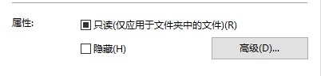

#《UVM实战》第二章例子
##实现遇到的问题
基本看完《UVM实战》第二章，很多细节，不太理解，想先把前面几个简单的例子实现一下看看，然后再回去推敲，继续往下看，但是开始没多久，就遇到了一些问题，囧。

下载了源码库，编译也通过了，能运行成功调用 uvm 库的 hello word，但是书上的例子运行不成功，错误如图第一行篮字，查阅一些资料解决方案，如图:

按提示去掉了命令行里面的+incdir+以后，错误变成：

 

查阅资料：

  
  
于是，去改文件属性，但是文件属性不管怎么改，总是这样：
 
  
  
在这个时候，文件属性这条，把我带入了思维死区，就一直在想是不是因为Windows10的系统问题导致了错误（听说就Windows10的文件属性是黑框框，其他系统不会这样），浪费了很多时间，真得有点气馁，于是请教工作了的学长，毕竟存在距离，不能很明白我的问题所在，不过还是很耐心的帮我查错，由于学长曾经自己用vcs成功实现过，于是我们把焦点放至命令行上，来回改命令，终无所获。

于是，又开始查网页，终于在EETOP上看见一个类似的论题，上面有个不同的解释是，应该在my_driver.sv中进行导包，否则无法调用uvm_driver。

所以，就该了源码的my_driver.sv，确实如此，改为以后就可以正常对了。

至于为何我运行源码有问题，学长就成功运行了呢？

  

虽然，不停的调错，枯燥乏味，但是调试成功的时候，还是极高兴的。对于验证，思维还是要发散开去，定式思维还是极忌讳的，以后要注意奥:-D！

