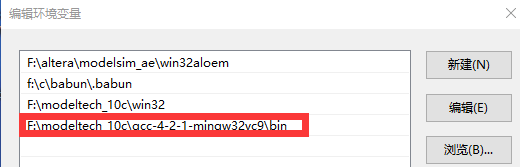
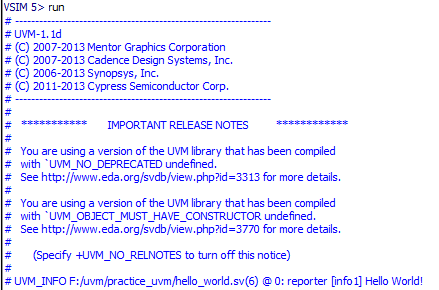

# windows 环境下配置 modelsim_uvm 验证平台

最近正在学习 UVM 验证方法学，是很好的验证工具，学习用的教材是张强编著的《UVM实战》。

下面用 ModelSim-uvm 做一个 Hello world。


1.安装 modelsim se 10.0c(我用的是这个版本)。

2.下载 uvm_1.1d  uvm-1.1d.tar.gz （http://bbs.eetop.cn/thread-460437-1-1.html）。
然后解压缩后，拷贝到 modelsim 安装目录的../verilog_src/ 目录下，我的目录是 F:\modeltech_10c\verilog_src.这里注意，拷贝过来之后，打开 uvm_1.1d 文件夹，应该能直接看到 bin/docs/examples/src/等文件夹和几个 txt 文件。

3.配置系统环境变量。打开 modelsim，在命令行下输入
```
set UVM_HOME F:/modeltech_10c/verilog_src/uvm-1-1d

set MODEL_TECH F:/modeltech_10c/win32  
```
(也可以设置为系统环境变量)

注意文件名不要有点(.)，会导致错误。

4.编译 uvm_1.1d 库文件。所谓编译库文件，我的理解是将 uvm_1.1d 编译成 windows 中 modelsim 可以加载的 dll 文件，因此这一个步骤是生成一个 .dll 文件的过程。这里需要 GCC 的编译命令，最新的是（modelsim-gcc-4.2.1-mingw32vc9）

 modelsim-gcc-4.2.1-mingw32vc9.part01.rar (14 MB) (在EETOP上均可下载到)

 modelsim-gcc-4.2.1-mingw32vc9.part02.rar (5.65 MB) (在EETOP上均可下载到)

解压缩后，复制到modelsim安装目录下，我的复制目录是（F:\modeltech_10c\gcc-4.2.1-mingw32vc9），打开该文件后能够直接看到bin/doc/include/info/lib/libexec/man/share文件夹，上面这些基本工作做完后，就可以编译.dll文件了。

5.编译.dll文件。在命令行下输入
```
F:/modeltech_10c/gcc-4.2.1-mingw32vc9/bin/g++.exe -DQUESTA -W -shared -Bsymbolic -I $MODEL_TECH/../include  $UVM_HOME/src/dpi/uvm_dpi.cc -o  $UVM_HOME/lib/uvm_dpi.dll $MODEL_TECH/mtipli.dll -lregex
```
注意，要先在 $UVM_HOME 目录下创建lib文件夹。

注意，装了GCC，修改了 modesim.ini 的配置C compiler 的配置和C++ compiler 的配置，新建了 project，但 modelsim 还是找不到 GCC。需要在 PATH 的环境变量里把 GCC 的路径加了进去，重启 modesim，重做第 3 步，在继续做下一步。



6.下 载hello_world.sv  hello_world.rar (231 Bytes)

创建 modelsim 工程，添加 hello_world.sv 文件。假设工程目录为 F:/uvm/practice_uvm/

7.编译 Hello_world_example 源文件
```
vlog +incdir+$UVM_HOME/src -L mtiAvm -L mtiOvm -L mtiUvm -L mtiUPF  F:/uvm/practice_uvm/hello_world.sv 
```
8.仿真 Hello_world_example (需要调用刚刚编译的 uvm_dpi.dll)
```
vsim -c -sv_lib $UVM_HOME/lib/uvm_dpi work.hello_world_example
```
选 run 100ns



9.结束仿真，在命令行下输入
```
quit -sim
```
